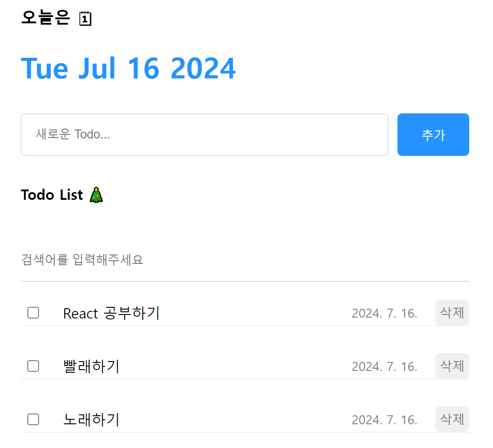
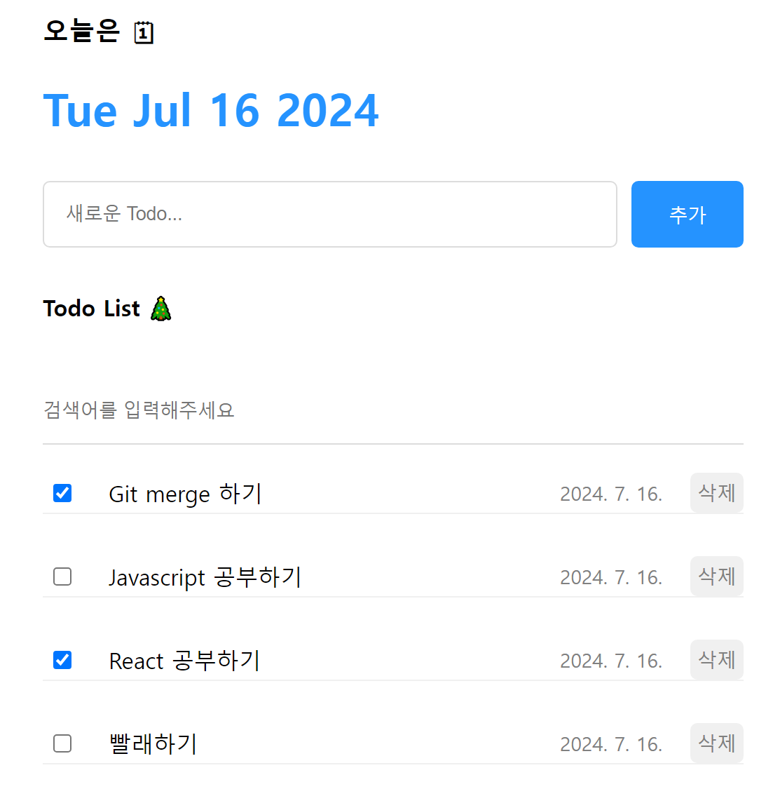

# 한입 크기로 잘라 먹는 React 강의 project
본 수업을 통해 3가지 프로젝트를 진행할 예정이다.

---

## Project 1 : Counter 앱 만들기
버튼을 클릭하여 count 숫자를 변경하는 앱을 만들었다.

{border=1px solid black}

### 배운 점
state와 상태 관리를 사용하기 위해서는 부모 component에서 state를 만들어야한다.
값을 변화시키는 component에서 state와 상태 관리 모두를 넘길 필요 없다.
부모(App)에서 이벤트 핸들러를 만들어 props로 전달하면 깔끔하다.

## Project 2 : Todo 앱 만들기

{ width=30% border=1px solid black }

### 배운 점
기본 CRUD + filter 기능을 배웠다.
추가로, enter를 입력했을 때를 이벤트 핸들러로 등록하고, onKeyDown을 사용하여 행동을 제어하였다.
또한, 마크다운 문법과 HTML 문법을 모두 사용해보았다.

마크다운 문법은 {추가CSS}이고,

HTML 문법은 <태그이름 src="파일 위치" alt="해당 파일 이름" 추가CSS>로 조금 다른 형태이다.
