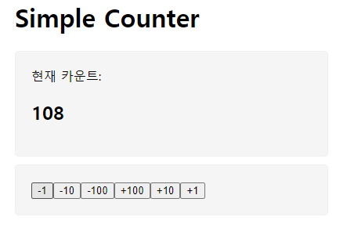

# 한입 크기로 잘라 먹는 React 강의 project
본 수업을 통해 3가지 프로젝트를 진행할 예정이다.

---

## Project 1 : Counter 앱 만들기
버튼을 클릭하여 count 숫자를 변경하는 앱을 만들었다.

### 배운 점
state와 상태 관리를 사용하기 위해서는 부모 component에서 state를 만들어야한다.
값을 변화시키는 component에서 state와 상태 관리 모두를 넘길 필요 없다.
부모(App)에서 이벤트 핸들러를 만들어 props로 전달하면 깔끔하다.